就当是怀旧吧。

<!--more-->

作者：[『随缘居』『随缘主人』](http://www.musecn.com/)

## 第一天

学习目的：安装调试ASP的环境，写出第一个HELLO  WORLD程序。   

首先我们来安装WINSOWS2000自带的IIS作为服务器。（WINSOWS98的PWS也可以，但是不推荐，安装大致和2000相同，这里就不详细说了。） 

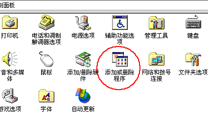
先是控制面板－添加或删除程序。 


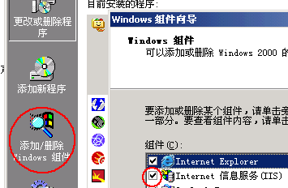
然后是添加删除windows组件－选中IIS组件前面的勾


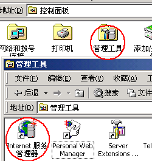
装好以后打开控制面板中的管理工具，会发现多了两个图标，打开IIS管理器


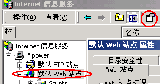
选择默认WEB站点，然后右键属性或者直接按快捷键


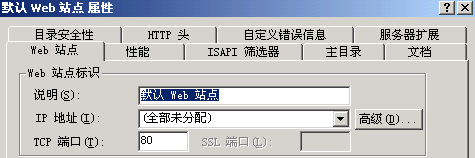
大家不要头痛，里面只有三个页面需要修改，先是WEB站点，如果用户有固定IP，可以分配一个IP


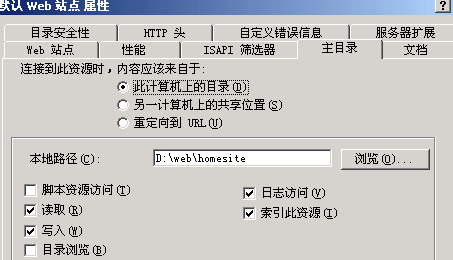
接下来在注目录中选择一个自己硬盘上面的文件夹存放网站，选中读取、写入


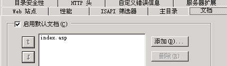
在文档中添加默认的页面，比如打 www.sina.com.cn 新浪就是调用了一个默认文档


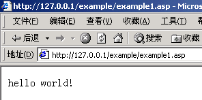
接下来也是最关键的：

在刚才你定义的一个文件夹里面新建一个文件，可以用记事本建立一个TXT文件然后改名为ASP,里面的内容如下 

```vbscript
<%response.write  "hello  world!"%> 
```


`response.write` 就是显示的意思，前后的 `<%%>` 是 asp 的标记符号，在这里面的信息都由服务器处理。保存以后就可以在浏览器里面运行这个文件了。127.0.0.1（=localhost）是本机的IP，后面再直接加上建立的那个文件名字就可以了，之所以我图片上面还有一个 example，那是因为我建立了一个虚拟目录，这个不知道不要紧，我们往下走，具体深入的东西大家自己慢慢研究，必尽我们的目的就是快速掌握嘛。 


## 第二天

学习目的：学会用表单元素向服务器传送变量，然后显示变量在客户端的浏览器。  

首先，让我们来看一下 DREAMWEAVER 的表单元素。

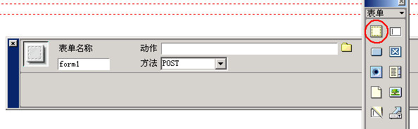
表单元素要放在一个表单域里面，建立一个表单域。然后修改动作里面的文件为要接受这个表单变量的ASP文件。方法有两种，一种是POST，这个方法传送的变量不会在浏览器的地址栏里面显示，可以大批量传送数据；GET则是会在浏览器地址栏里面显示的，等一会举例子。

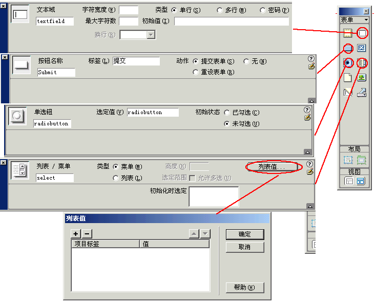

下面我们来一个一个看表单元素。1、文本域，这个是最基本的，传送的是文本信息，一般用户名，密码都要用这个传送，不过要是密码的话要在类型里面选择密码，这样就会以*代替显示出来的字符，文本域的名字很重要，以后会用到这个名字所以一般不用默认的名字。现在举一个例子：如果文本域的名字是name的话，用来传送网上用户登记的名字，在表单域里面，传送到reg.asp，用POST方法，那么在reg.asp里面这样得到变量<%name=request.form("name")%>如果要显示变量再家加一句，response.write name，这样就形成了一个从客户端到浏览器再回到客户端的过程。如果方法用的是GET的话，那么就改为name=request.querystring("name")实际上两者可以统一为name=request("name")。下面看看按钮，按钮里面无非两种，一种是提交表单的按钮，一种是重新输入的按钮。单选按钮，一个按钮有一个值。在列表里面同样，添加列表选项和值。下面举一个例子，实际上各种表单元素都是差不多的。下面是DREAMWEAVER里面的代码：

```html
<form name="form1" method="post" action="reg.asp">
    姓名： 
    <input type="text" name="name"> <!-- 文本域，名字叫name -->
    <br>
    密码： 
    <input type="password" name="psw"> <!-- 文本域，用来输入密码，名字叫psw -->
    <br>
    <br>
    性别： 
    <input type="radio" name="sex" value="男"> <!-- 单选，名字叫sex，数值是"男"  -->
    男 
    <input type="radio" name="sex" value="女"> <!-- 单选，名字叫sex，数值是"女"  -->
    女 <br>
    <br>
    城市： 
    <select name="city">
        <option value="上海" selected>上海</option> <!-- 复选，大家自己分析一下 -->
        <option value="北京">北京</option>
    </select>
    <br>
    <input type="submit" name="Submit" value="提交"> <!-- 提交按钮  -->
    <input type="reset" name="Submit2" value="重置">
</form>
```

下面是reg.asp的代码，用来显示出刚才受到的信息：

```asp
<%
name=request.form("name")
psw=request.form("psw")
sex=request.form("sex") 
city=request.form("city")
response.write name
response.write psw
response.write sex
response.write city
%> 
```

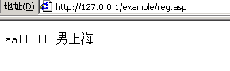
等学会了数据库以后，是不是觉得做一个留言簿很简单？

## 第三天

学习目的：学会ACCEES数据库的使用，并建立一个将来要用的留言簿数据库。

首先，大家要安装OFFICE里面的ACCEES（我的演示是OFFICE  XP版本），安装过程这里就不说了，安装好以后会出现下图的菜单。 

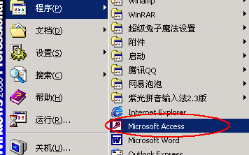

单击打开ACCEES 


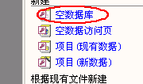

安空数据库，新建一个数据库，文件名字可以叫 gustbook.mdb，我这里叫 example3.mdb （为了安全起见，文件名复杂一点好，因为 ACCESS 数据库可以被下载的！！） 

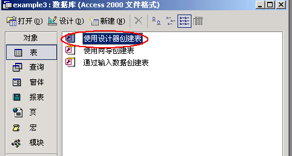

使用设计器创建新的表，一个数据库MDB文件里面可以有多个表


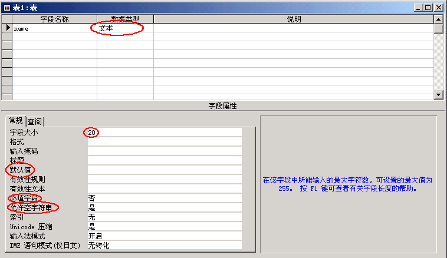

填写字段名字然后选择字段类型，一条记录可以有很多字段，可以有很多字段类型，字段大小的意思就是这个字段最多可以容纳的字符树，当这个字段没有任何信息是，ACCEES会用默认值代替（没有任何信息不是空的意思），一般必填字段和允许空字符串分别设置为否、是，以防止出错


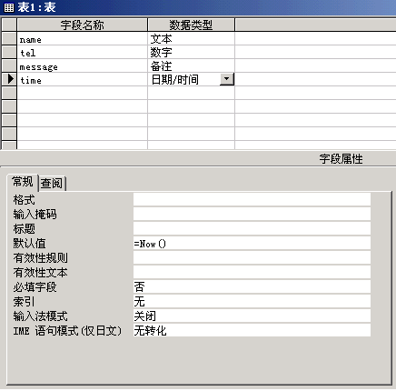

按照上图大家分别建立几个字段，在时间中默认值为=now()就是这个字段不需要填写，系统直接以当前时间代替


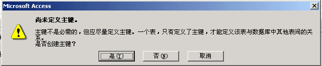 

所以的字段都建立以后，关闭这个窗口，系统会出现上图的提示，选择是，主键是记录的标识，为了以后简单，大家可以把编号改为ID，还有在ACCEES里面尽量不要用中文表示字段名字


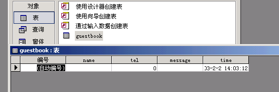

最后，把这个表的名字设置为guestbook，然后双击打开这个表，观看表里面的记录 好了，大家不要急，这个数据库以后有用的，大家不要删除。


## 第四天

学习目的：掌握ACCESS数据库的连接和读取记录。

天要学习的内容有一点枯燥，但是很重要。在这里大家不需要知道命令具体的运行情况，外面的很多书籍之所以不适合入门就是因为介绍了太多的理论知识，让初学者一头雾水。   下面开门见山，看两句话： 

```asp
<%
set conn=server.createobject("adodb.connection")
conn.open "driver={microsoft access driver (*.mdb)};dbq="&server.mappath("example3.mdb")
%>
```


第一句话定义了一个 adodb 数据库连接组件，第二句连接了数据库，大家只要修改后面的数据库名字就可以了。是不是很简单？ 

下面再看三句： 

```asp
<%
exec="select * from guestbook"
set rs=Server.CreateObject("adodb.recordset")
rs.open exec,conn,1,1 
%>

```


这三句加在前面两句的后面，

第一句：设置查询数据库的命令，select 后面加的是字段，如果都要查询的话就用*，from 后面再加上表的名字，我们前面建立的是不是一个 gustbook 表阿？

第二句：定义一个记录集组件，所有搜索到的记录都放在这里面，

第三句是打开这个记录集，exec 就是前面定义的查询命令，conn 就是前面定义的数据库连接组件，后面参数 `1，1`，这是读取，后面讲到修改记录就把参数设置为 `1，3`，好了接下来我们读取记录。


```asp
<table width="100%" border="0" cellspacing="0" cellpadding="0">
    <% do while not rs.eof %>
    <tr>
    <td><%=rs("name")%></td>
    <td><%=rs("tel")%></td>
    <td><%=rs("message")%></td>
    <td><%=rs("time")%></td>
    </tr>
    <%
    rs.movenext
    loop
    %>
</table>
```

在一个表格中，我们用 4 列分别显示了上次建立的表里面的四个字段，用 do 循环，`not  rs.eof` 的意思是条件为没有读到记录集的最后，`rs.movenext` 的意思是显示完一条转到下面一条记录，`<%=%>` 就等于`<%response.write%>` 用于在 html 代码里面插入 asp 代码，主要用于显示变量。   

好了今天就结束了，大家可以多实践，可以先下载我的示例看一下，调试一下。下面是我机器上面的结果图片。 

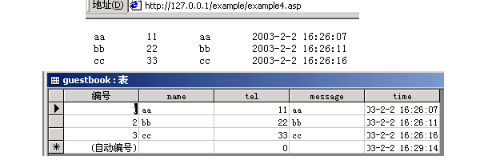


## 第五天

学习目的：学会数据库的基本操作1（写入记录）   

数据库的基本操作无非是：查询记录，写入记录，删除记录，修改记录。今天我们先学习写入记录。 先建立一个表单： 

```html
<form name="form1" method="post" action="example5.asp">
    name <input type="text" name="name"><br>
    tel <input type="text" name="tel"><br>
    message <input type="text" name="message" value=""><br>
    <input type="submit" name="Submit" value="提交">
    <input type="reset" name="Submit2" value="重置">
</form>
```


表单提交到 example5.asp，下面是 example5.asp 的代码：


```vbscript
<%
set conn=server.createobject("adodb.connection")
conn.open "driver={microsoft access driver (*.mdb)};dbq="& server.mappath("example3.mdb")
name=request.form("name")
tel=request.form("tel")
message=request.form("message") 
exec="insert into guestbook (name, tel, message) values ('"+ name +"',"+ tel +",'"+ message +"')"
conn.execute exec
conn.close
set conn=nothing
response.write "记录添加成功!"
%>
```

在这里前面两句我不说了，后面三句我也不说了，前面说过 exec 里面的是执行的命令，添加记录的比较繁，大家要仔细看。`insert  into`  后面加的是表的名字，后面的括号里面是需要添加的字段，不用添加的或者字段的内容就是默认值的可以省略。注意，这里的变量一定要和 ACCESS 里面的字段名对应，否则就会出错。`values` 后面加的是传送过来的变量。exec 是一个字符串，`"insert  into  guestbook( name, tel, message) values ('"`是第一段，在ASP里面不能嵌双引号，所以可以用'代替双引号，放在双引号里面，连接两个变量用 `+` 或者 `&` 所以 `"',"` 又是一段，中间夹了一个 name 就是表单传来的变量，这样就可以在这个变量外面加两个 `''`，表示是字符串了，后面的 tel 是数字型变量所以不需要外面包围 `''`，大家慢慢分析这句话，如果用表单传来的数据代替变量名字的话这句话为（假设name="aaa",tel=111,message="bbb"）：`"insert  into guestbook(name,tel,message)values('aaa',111,'bbb')"`。

接下来的 `conn.execute`  就是执行这个 exec 命令，最后别忘记把打开的数据库关闭，把定义的组件设置为空，这样可以返回资源。上次的读取为了简单，我没有关闭，大家可以补充上去：

```vbscript
<%
rs.close
set rs=nothing
conn.close
set conn=nothing
%>
```

记住，次序不可以颠倒！ 


## 第六天

学习目的：学会数据库的基本操作2（查询记录）   

在第四天中我们有这样一个程序：

```vbscript
<%
set conn=server.createobject("adodb.connection")
conn.open "driver={microsoft access driver (*.mdb)};dbq="&server.mappath("example3.mdb")
exec="select * from guestbook"
set rs=server.createobject("adodb.recordset")
rs.open exec,conn,1,1 
%>
```

我们查询的是所有的记录，但是我们要修改、删除记录的时候不可能是所有记录，所有我们要学习检索合适的记录。先看一条语句： 

```vbscript
a="张三"
b=111 
exec="select * from guestbook where name='"+a+"'and tel="+b
```


where 后面加上的是条件，与是 `and`，或是 `or`，我想 `=，<=，>=，<，>` 的含义大家都知道吧。这句话的意思就是搜索 name 是张三的，并且电话是 111 的记录。还有一点就是如果要搜索一个字段里面是不是包含一个字符串就可以这么写： `where  instr(name,a)` 也就是搜索 name 里面有 a（张三）这个字符串的人。 

我这里的 a,b, 是常量，大家可以让 a,b 是表单提交过来的变量，这样就可以做一个搜索了。 下面大家看看这个代码，理解一下： 

```html
<form name="form1" method="post" action="example6.asp">
    搜索：<br>
    name =
    <input type="text" name="name">
    and tel= 
    <input type="text" name="tel">
    <br>
    <input type="submit" name="Submit" value="提交">
    <input type="reset" name="Submit2" value="重置">
</form>
```


example6.asp：

```php+HTML
<%
name=request.form("name")
tel=request.form("tel")
set conn=server.createobject("adodb.connection")
conn.open "driver={microsoft access driver (*.mdb)};dbq="&server.mappath("example3.mdb")
exec="select * from guestbook where name='"+name+"' and tel="+tel
set rs=server.createobject("adodb.recordset")
rs.open exec,conn,1,1
%>
<html>
<head>
<title>无标题文档</title>
<meta http-equiv="Content-Type" content="text/html; charset=gb2312">
</head> 
<body bgcolor="#FFFFFF" text="#000000"> 
<table width="100%" border="0" cellspacing="0" cellpadding="0">
<%
do while not rs.eof
%>
    <tr>
        <td><%=rs("name")%></td>
        <td><%=rs("tel")%></td>
        <td><%=rs("message")%></td>
        <td><%=rs("time")%></td>
	</tr>
<%
rs.movenext
loop
%>
</table>
</body>
</html> 
```


## 第七天

学习目的：学会数据库的基本操作3（删除记录） 

开门见山，大家直接看程序。 

```sql
exec="delete * from guestbook where  id="& request.form("id") 
```

上面这句话完成了删除记录的操作，不过锁定记录用了记录唯一的表示id，我们前面建立数据库的时候用的是系统给我们的主键，名字是编号，由于是中文的名字不是很方便，大家可以修改为 id，不修改的话就是 

```sql
exec="delete  * from guestbook where  编号="& request.form("id") 
```


下面我们看完整的代码：一个表单传给 ASP 文件一个 ID，然后这个 ASP 文件就删除了这个 ID。 

```html
<form name="form1" method="post" action="example7.asp">
delete: 
<input type="text" name="id">
<input type="submit" name="Submit" value="提交">
</form>
```

example7.asp：

```asp
<%
set conn=server.createobject("adodb.connection")
conn.open "driver={microsoft access driver (*.mdb)};dbq="&server.mappath("example3.mdb")
exec="delete * from guestbook where 编号="&request.form("id")
conn.execute exec
%>
```


我在示例里面加了一个 example72.asp，和 example4.asp 差不多，就是加了一个 id 字段，大家可以先运行这个文件看一下所有记录的 ID 和想删除记录的 ID，删除记录以后也可以通过这个文件复查。等到最后一天，我们会把所有的这些东西整合的。大家就不会需要这么麻烦的操作。  

example72.asp：

```asp
<%
set conn=server.createobject("adodb.connection")
conn.open "driver={microsoft access driver (*.mdb)};dbq="&server.mappath("example3.mdb")
exec="select * from guestbook"
set rs=server.createobject("adodb.recordset")
rs.open exec,conn,1,1 
%>
<html>
<head>
<title>无标题文档</title>
<meta http-equiv="Content-Type" content="text/html; charset=gb2312">
</head>

<body bgcolor="#FFFFFF" text="#000000">
<table width="100%" border="0" cellspacing="0" cellpadding="0">
<%
do while not rs.eof
%>
    <tr>
        <td><%=rs("编号")%></td>
        <td><%=rs("name")%></td>
        <td><%=rs("tel")%></td>
        <td><%=rs("message")%></td>
        <td><%=rs("time")%></td>
    </tr>
<%
rs.movenext
loop
%>
</table>
</body>
</html>


```


## 第八天

学习目的：学会数据库的基本操作4（修改记录）   

先来看代码： 

```asp
<%
set conn=server.createobject("adodb.connection")
conn.open "driver={microsoft access driver (*.mdb)};dbq="&server.mappath("test.mdb")
rem 这不是以前的一个数据库，里面就aa,bb两个字段
exec="select * from test where id="& request.querystring("id")
set rs=server.createobject("adodb.recordset")
rs.open exec,conn
%>
<form name="form1" method="post" action="modifysave.asp">
    <table width="748" border="0" cellspacing="0" cellpadding="0">
        <tr> 
            <td>aa</td>
            <td>bb</td>
        </tr>
        <tr> 
            <td>
            	<input type="text" name="aa" value="<%=rs("aa")%>">
            </td>
            <td>
                <input type="text" name="bb" value="<%=rs("bb")%>">
                <input type="submit" name="Submit" value="提交">
                <input type="hidden" name="id" value="<%=request.querystring("id")%>">
            </td>
        </tr>
    </table>
</form>
<%
rs.close
set rs=nothing
conn.close
set conn=nothing
%>
```

大家到现在应该分析这个代码没有什么问题，这个代码的作用是接受前面一个页面的 ID 然后显示这条记录，文本框即是输入的地方也是显示的地方，如果需要修改的话修改以后按提交；如果不需要修改就可以直接按提交按钮。这里还有一个东西以前没有说，那就是隐藏的表单元素：hidden 元素，里面的 value 是不用用户输入的，会随着表单一起提交，用于传递变量。下面是 modifysave.asp 的代码：

```asp
<%
set conn=server.createobject("adodb.connection")
conn.open "driver={microsoft access driver (*.mdb)};dbq="& server.mappath("test.mdb")
exec="select * from test where id="& request.form("id")
set rs=server.createobject("adodb.recordset")
rs.open exec,conn,1,3
rs("aa")=request.form("aa")
rs("bb")=request.form("bb")
rs.update
rs.close
set rs=nothing
conn.close
set conn=nothing
%>
```

在这里，`rs.open  exec,conn,1,3` 后面的参数是 `1, 3`，这我以前提过，修改记录就要用 `1，3`。实际上修改记录很容易看懂，记录集是 `rs`，`rs("aa")` 就是当前记录 aa 字段的东西，让它等于新的数据 `request.form("aa")`当然就修改了，不过最后别忘记保存，那就是 `rs.update`！ 

说到这里，记录的搜索，读取，修改，插入都说了，通过这最基本的东西就可以作出复杂的东西了，外面的大型数据库：新闻系统，留言簿就是字段多一点罢了。今天的示例中的代码是结合以前的数据库的，大家DOWN了以后回去调试分析一下。（rar里面的那个example72.asp还是供大家查询记录ID和核对修改以后的记录用的）


## 第九天

学习目的：基本的SESSION组件，总结response，request组件。   

首先，有会员系统的任何程序都会用到检测是不是用户已经登陆这个步骤。这就用到了 SESSION 组件，下面我们  看一个代码来说明。 

```asp
<%
session("islogin")="yes"
%>
```

这句话的意思就是在 session 里面定义一个 islogin 字符串变量，值为 "yes"，直接可以赋值，不需要声明。是不是很简单？ 如果我们做管理员登录系统的话，首先是一段检测是不是管理员.

```vbscript
if 是 then 
	session("isadmin")=yes"
else 
	session("isadmin")="no"
end if
```


```asp

在每一个需要管理员才能看的页面最前面加上
<%
if not session("isaadmin")="yes" then
response.redirect "login.htm"
%>
```

在每一个需要管理员才能看的页面最前面加上 

```asp
<%
if not session("isaadmin")="yes" then
response.redirect "login.htm"
%>
```

这样一般用户就无法打开这个页面。解释一下 `response.redirect`，它是转向的意思，后面的 "login.htm" 就是转向的文件。这样没有登录的管理员是无法看到后面的内容的。   

下面总结一下 response 组件基本就是用到 `response.write  ()`，`response.redirect()`  分别是写字符串和转向的作用 request 基本就是 `request.form()`，`request.querystring()`  分别是接受 post, get 方法传来的信息

今天就说到这里了，最后我的示范是一个登陆系统大家可以研究一下，基本就是上面的知识点比较简单的。 


## 第十天

学习目的：分页技术，总结   

今天最后一天我们学习一下 ASP 里面稍微难一点地分页技术，毕竟当我们有N条记录的时候我们不可能把所有记录显示在一个页面里面吧。 

```asp
<%
exec="select * from test"
set rs=server.createobject("adodb.recordset")
rs.open exec,conn,1,1
rs.PageSize=3
pagecount=rs.PageCount 
page=int(request.QueryString ("page"))
if page<=0 then page=1
if request.QueryString("page")="" then page=1
rs.AbsolutePage=page 
%>
```

`rs.pagesize` 设置一个页面里面显示的记录数，`pagecount` 是我们自己定义的一个变量，`rs.pagecount`是记录的个数，`page` 也是我们自己定义的一个变量，我们下一页的链接可以设置为 `list.asp?page=<%=page+1%>`，上一页的链接可以设置为 `list.asp?page=<%=page-1%>`，这样当按下链接的时候调用页面自己，page 这个变量就+1 或者 -1 了，最后我们让 `rs.absolutepage`（当前页面）为第 page 页就可以了。 

`if  request.QueryString("page")="" then  page=1`，这句话的作用就是我们打开 list.asp 的时候没有跟随page 变量，自动设置为 `page=1`，防止出错，还有当我们 `if....then...` 放在一行的时候 `end  if` 可以省略。是不是分页也不难？ 

下面说一种特殊情况：

`if page=1 and not  page=pagecount`，这个时候没有上一页，但是有下一页 

`elseif page=pagecount and not  page=1`，这个时候没有下一页，但是有上一页 

`elseif page<1`，这个时候没有任何记录 

`elseif  page>pagecount then`，这个时候没有任何记录 

`elseif page=1 and  page=pagecount`，这个时候没有上一页，没有下一页 

`else`，这个时候有上一页，也有下一页。 

下面看一段显示 1 到 n 页，且每一个数字点击以后就出现这个数在代表的页面的代码，很常见哦。


```asp
<%for i=1 to pagecount%>
	<a href="list.asp?page=<%=i%>"><%=i%></a>
<%next%>

```

`for....next` 是循环从 `i=1` 开始，循环一次加 1 到 `pagecount` 为止。


最后我的实例里面包含了一个最简单的 ASP 程序，但是功能样样有，是ASP的精髓，每一个ASP大型程序都包含了它。 

- add.htm增加记录页面 

- add.asp增加记录操作 

- conn.asp数据库链接 

- del.asp删除记录操作 

- modify.asp修改记录页面 

- modifysave.asp修改记录操作 

- list.asp这个是这个程序的核心，通过这个页面实现记录的添加、修改、删除。 

- test.mdb数据库，里面有aa，bb两个字段：**aa数字型只能接受数字，bb是字符型**。 

好了，十天到今天就结束了，我想我这个教程是让大家入门的，大家觉得写的浅也不要责怪必尽不可能初学者和高手都照顾到吧，最后我想说一句，今天的实例是 ASP 的精华，大家一定要好好研究，通了这个程序，你会发现你已经会 ASP 了。谢谢大家的支持！大家有问题可以在我的论坛里面留言，希望大家帮站长多多宣传本站，转贴本站文章的也请著名出处，谢谢合作。 


转自：

- [Go语言HTTP客户端实现简述](http://c.biancheng.net/view/4520.html)

EOF

---

Power by TeXt.
